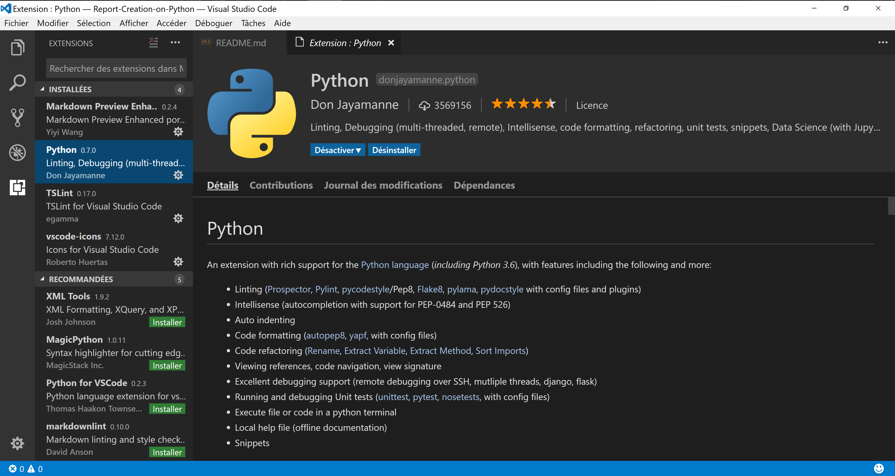
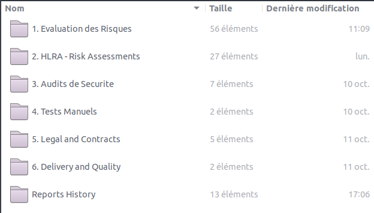

# Report-Creation-on-Python
Generate my Security Report with a Python module.

### 1. Prior to installation
To make this module works properly, you need to install several external modules.

You need :
* [Python 3.x](https://www.python.org/)
* [xlxswriter](https://xlsxwriter.readthedocs.io/index.html)
* [python-pptx](https://python-pptx.readthedocs.io/en/latest/#)

Install Python 3 on your operating system following the [Python website's instructions](https://wiki.python.org/moin/BeginnersGuide/Download).

The easiest way to do this is to use the *pip* installer.
```python
pip install xlsxwriter or python3.x -m pip install xlsxwriter
pip install python-pptx or python3.x -m pip install python-ppx
```

To develop this program, I use [Visual Studio Code](https://code.visualstudio.com/) with the [Python](https://marketplace.visualstudio.com/items?itemName=donjayamanne.python) extension.



Be sure to change your Python interpreter to Python3 as this program was developed for Python3.
In Visual Studio Code, you can do this very easily following the instructions [here](https://github.com/DonJayamanne/pythonVSCode/wiki/Miscellaneous#select-an-interpreter).

### 2. Installation

Download the zip file from Github or clone the repository.

As Python is an interpreted language, you just need the source files to make it work.

### 3. Set up your directories

1. Describe your phases as root directory.
1. Describe the projects and objects you need to follow inside each phase directory.


Your folder hierarchy should be as followed : 



The directory of project and object must be described as followed : 
 "**_Phase - Project Name - Object Name_**"

 The Phase must be one of the following : 
 * Done
 * In Progress
 * Not Started
 * Not Evaluated

### 4. Launch the application

Then you only need to run the *writereport.py* module in your terminal.

>`py /path/to/writereport.py --help`

Your Excel and Powerpoint reports are located into the 'ReportHistory' folder.

### 5. Explanation about creating command alias on Windows, MacOS and Linux

To launch the reports creation in a easier and quicker, you can use alias on macOS and Linux or Powershell Alias on Windows.

See the explanations above.
For Windows :
https://technet.microsoft.com/en-us/library/ee176913.aspx

change the Execution policy if you don't have any rights to launch powershell profiles :
https://docs.microsoft.com/en-us/powershell/module/microsoft.powershell.core/about/about_execution_policies?view=powershell-5.1&viewFallbackFrom=powershell-Microsoft.PowerShell.Core

For MacOS and Linux :
Create the .bash_profile file using the command line program called ‘nano’ if it doesn’t exist:
>`nano ~/.bash_profile`

Add this line the end of your file: 
>`alias writereport='python3 /path/to/writereport.py'`

Save your file
>ctrl-x y

Refresh the bash shell environment:
>`source ~/.bash_profile`

If you use the fish shell, just type that command:
>`alias writereport 'python3 /path/to/writereport.py'`


:books: Doc : Add explanation on how to create an alias on macOS
In order for the user to have a shortcut to the app and don't require to enter the all path the 'writereport.py' python file.